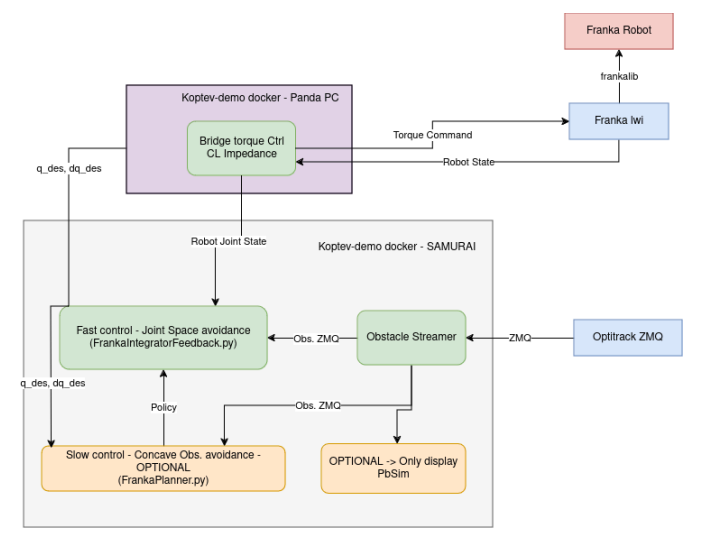

# Mikhail Koptev's Obstacle Avoidance Demo README

This code comes from several repositories and has been re-structured to be used easily to start Mikhail KOPTEV's Obstacle Avoidance demo at LASA.

## Structure 
This demo needs 3 computers : 
- PANDA_PC : with RT/os, runs flwi interface and torque controller
- RTX_PC : with good GPU, runs NN and optitrack bridge
- Optitrack PC : Windows, runs motive and streams optitrack
This demo uses 3 dockers :
- franka-lightweight-interface: to be run on the computer connected to the panda (called PANDA_PC), used to communicate with the robot
- optitrack : used to publish optitrack info using zmq, should be run on RTX_PC
- koptev-demo : used to run all python code from Mikhail, should be run on RTX_PC (except franka_zmq_bridge which should run on computer connected to panda)

Note : docker commands rely on [aica-docker scripts](https://github.com/aica-technology/docker-images) which should be installed on compputers sued for the demo.



# Optitrack
Need these two assets with these specific IDs:
- ball_koptev : ID = 1001
- franka_base17 : ID = 1096
To use human spheres :
- neck : ID = 1002
- pelvis : ID = 1003
- right_elbow : ID = 1004
- right_wrist : ID = 1005
- left_elbow : ID = 1006
- left_wrist : ID = 1007

Note : to use human spheres, one msut remake the markers and attach them to someone and use at least neck right elbow and right wrist.
Need to change the value of use_single_obstacle in ObstacleStreamerOptitrack.py l.177 to false

## RUN DEMO

Open the 3 docker containers :
- fwli on computer connected to panda
- optitrack and koptev-demo on RTX_PC

Make sure the IP adresses are correct and communication runs smoothly. These can be checked in the ds_mppi/config.yaml file and in franka_zmq_bridge/bridge_torque_controller.py

Then run the following commands.

### Terminal 1 - Connect to the robot
On PANDA_PC
```console
cd ~/Workspace/koptev_demo/dependencies/franka-lightweight-interface
bash run-rt.sh
franka_lightweight_interface 17 panda_ --sensitivity low --joint-damping off
```

### Terminal 2 - Optitrack ZMQ bridge
On RTX_PC
```console
cd ~/Workspace/koptev_demo/dependencies/optitrack
bash docker-build.sh (IF never build before)
bash docker-run.sh
```

### Build and start docker commands
All the next commands must be run from inside the koptev-demo container, which can be build and start with these commands :
```console
cd ~/Workspace/koptev_demo
bash docker/build-image.sh
bash docker/start-docker.sh
```

### Terminal 3 - Torque control bridge for robot
On PANDA_PC
```console
cd ~/Workspace/koptev_demo
bash docker/start-docker.sh
cd franka_zmq_bridge/
python3 bridge_torque_controller.py
```

### Terminal 4 - Tracking obstacles with optitrack
On RTX_PC
```console
cd ~/Workspace/koptev_demo
bash docker/start-docker.sh -m connect
cd ds_mppi/
python3 obstacleStreamerOptitrack.py
```
### Terminal 5 - Pybullet Simulation (OPTIONAL, only for visual display)
On Panda_PC (if doesn't slow things down)
```console
cd ~/Workspace/koptev_demo
bash docker/start-docker.sh -m connect
cd ds_mppi/
python3 pbSim.py
```

### Terminal 6 - Integrator Feedback
On RTX_PC
```console
cd ~/Workspace/koptev_demo
bash docker/start-docker.sh -m connect
cd ds_mppi/
python3 frankaIntegratorFeedback.py
```

### Terminal 7 - Optimization for concave obstacles (OPTIONAL)
On RTX_PC
Planner (optim thingy) for concave obstacles -> do not launch unless you have good computer
```console
cd ~/Workspace/koptev_demo
bash docker/start-docker.sh -m connect
cd ds_mppi/
python3 frankaPlanner.py
```

## Sources 
Code originally comes from these repos and has been restructured to be easily used : 

https://github.com/epfl-lasa/OptimalModulationDS

https://github.com/m-koptev/franka_zmq_bridge

https://github.com/m-koptev/optitrack_lasa


## Authors/Maintainers

Mikhail KOPTEV (mikhail.koptev@epfl.ch)
Maxime GAUTIER (maxime.gautier@epfl.ch)
